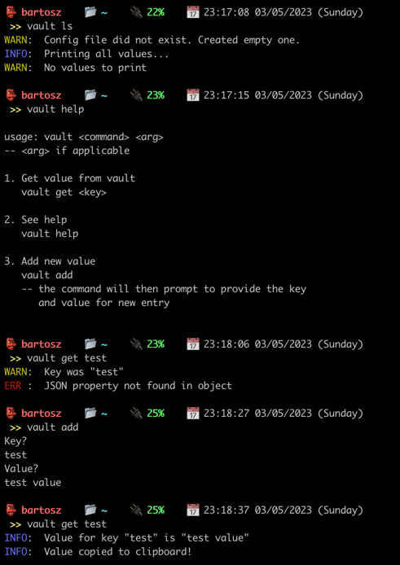

# CLI tool to manage frequently used kvps.

NOTE: Requires `cargo` to perform `install.sh` installation (version used in project `1.67.1`).

## How to install?
1. Requires installation on `Darwin` (`OSX`) due to current `.zshrc` limitation
   (you can change it to `.bashrc` in `/install/*.sh` to install on `Linux`).
2. Run `install.sh` (the script adds a function in `$HOME/vault`) and 
links it to `.zshrc`.
3. (you may need to restart `zsh` to see changes applied)
4. Run `vault help` to see if it's working.

## Sample usage
